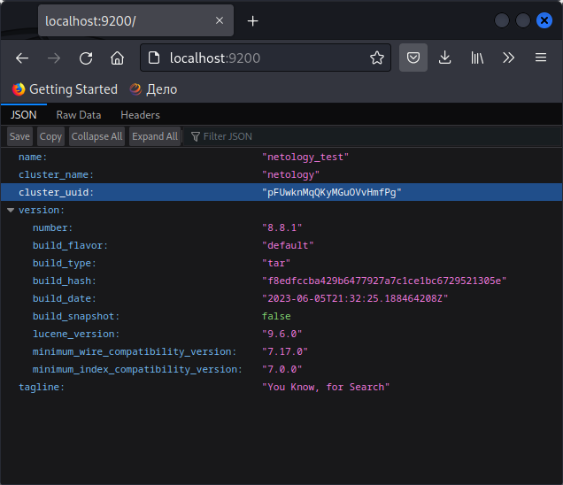

# Домашнее задание к занятию 5. «Elasticsearch»

## Задача 1

В этом задании вы потренируетесь в:

- установке Elasticsearch,
- первоначальном конфигурировании Elasticsearch,
- запуске Elasticsearch в Docker.

Используя Docker-образ [centos:7](https://hub.docker.com/_/centos) как базовый и 
[документацию по установке и запуску Elastcisearch](https://www.elastic.co/guide/en/elasticsearch/reference/current/targz.html):

- составьте Dockerfile-манифест для Elasticsearch,
- соберите Docker-образ и сделайте `push` в ваш docker.io-репозиторий,
- запустите контейнер из получившегося образа и выполните запрос пути `/` c хост-машины.

Требования к `elasticsearch.yml`:

- данные `path` должны сохраняться в `/var/lib`,
- имя ноды должно быть `netology_test`.

В ответе приведите:

- текст Dockerfile-манифеста,
```
FROM centos:centos7
RUN     yum clean all && \
        groupadd --gid 1000 elasticsearch && \
        adduser --uid 1000 --gid 1000 --home /usr/share/elasticsearch elasticsearch && \
        mkdir /var/lib/elasticsearch/ && \
        chown -R 1000:1000 /var/lib/elasticsearch/
USER 1000:1000
WORKDIR /usr/share/elasticsearch
COPY ./elasticsearch-8.8.1-linux-x86_64.tar.gz /usr/share/elasticsearch/
RUN     tar -xzf elasticsearch-8.8.1-linux-x86_64.tar.gz && \
        cp -rp elasticsearch-8.8.1/* ./ && \
        rm -fR elasticsearch-8.8.1*
COPY ./elasticsearch.yml /usr/share/elasticsearch/config/
EXPOSE 9200 9300
CMD ["bin/elasticsearch"]
```

- [ссылку на образ в репозитории dockerhub](https://hub.docker.com/repository/docker/ashubin83/my-elastic/general)

- ответ `Elasticsearch` на запрос пути `/` в json-виде.
  


Подсказки:

- возможно, вам понадобится установка пакета perl-Digest-SHA для корректной работы пакета shasum,
- при сетевых проблемах внимательно изучите кластерные и сетевые настройки в elasticsearch.yml,
- при некоторых проблемах вам поможет Docker-директива ulimit,
- Elasticsearch в логах обычно описывает проблему и пути её решения.

Далее мы будем работать с этим экземпляром Elasticsearch.

## Задача 2

В этом задании вы научитесь:

- создавать и удалять индексы,
- изучать состояние кластера,
- обосновывать причину деградации доступности данных.

Ознакомьтесь с [документацией](https://www.elastic.co/guide/en/elasticsearch/reference/current/indices-create-index.html) 
и добавьте в `Elasticsearch` 3 индекса в соответствии с таблицей:

| Имя | Количество реплик | Количество шард |
|-----|-------------------|-----------------|
| ind-1| 0 | 1 |
| ind-2 | 1 | 2 |
| ind-3 | 2 | 4 |

Получите список индексов и их статусов, используя API, и **приведите в ответе** на задание.

```
[root@acaa358517a8 elasticsearch]# curl  -u elastic http://localhost:9200/_cat/indices?v
Enter host password for user 'elastic':
health status index uuid                   pri rep docs.count docs.deleted store.size pri.store.size
green  open   ind-1 OnQ_H5dNTHSLNpumZm34AA   1   0          0            0       225b           225b
yellow open   ind-3 K7luNUnzQf-cMRJb9iBKSQ   4   2          0            0       900b           900b
yellow open   ind-2 lt5Blq3VRVGIhKzsZEMD2g   2   1          0            0       450b           450b
[root@acaa358517a8 elasticsearch]# 
```
Получите состояние кластера `Elasticsearch`, используя API.
```
[root@acaa358517a8 elasticsearch]# curl -u elastic http://localhost:9200/_cluster/health?pretty
Enter host password for user 'elastic':
{
  "cluster_name" : "netology",
  "status" : "yellow",
  "timed_out" : false,
  "number_of_nodes" : 1,
  "number_of_data_nodes" : 1,
  "active_primary_shards" : 7,
  "active_shards" : 7,
  "relocating_shards" : 0,
  "initializing_shards" : 0,
  "unassigned_shards" : 10,
  "delayed_unassigned_shards" : 0,
  "number_of_pending_tasks" : 0,
  "number_of_in_flight_fetch" : 0,
  "task_max_waiting_in_queue_millis" : 0,
  "active_shards_percent_as_number" : 41.17647058823529
}
```
Как вы думаете, почему часть индексов и кластер находятся в состоянии yellow?

из зи того что часть шард имеют статус:  "unassigned_shards" : 10,

Удалите все индексы.
```
[root@acaa358517a8 elasticsearch]# curl -u elastic -X DELETE http://localhost:9200/ind-1?pretty
Enter host password for user 'elastic':
{
  "acknowledged" : true
}
[root@acaa358517a8 elasticsearch]# curl -u elastic -X DELETE http://localhost:9200/ind-2?pretty
Enter host password for user 'elastic':
{
  "acknowledged" : true
}
[root@acaa358517a8 elasticsearch]# curl -u elastic -X DELETE http://localhost:9200/ind-3?pretty
Enter host password for user 'elastic':
{
  "acknowledged" : true
}
[root@acaa358517a8 elasticsearch]# curl  -u elastic http://localhost:9200/_cat/indices?v
Enter host password for user 'elastic':
health status index uuid pri rep docs.count docs.deleted store.size pri.store.size
```

**Важно**

При проектировании кластера Elasticsearch нужно корректно рассчитывать количество реплик и шард,
иначе возможна потеря данных индексов, вплоть до полной, при деградации системы.

## Задача 3

В этом задании вы научитесь:

- создавать бэкапы данных,
- восстанавливать индексы из бэкапов.

Создайте директорию `{путь до корневой директории с Elasticsearch в образе}/snapshots`.

Используя API, [зарегистрируйте](https://www.elastic.co/guide/en/elasticsearch/reference/current/snapshots-register-repository.html#snapshots-register-repository) 
эту директорию как `snapshot repository` c именем `netology_backup`.
```
[root@acaa358517a8 elasticsearch]# curl  -u elastic -X PUT http://localhost:9200/_snapshot/netology_backup?pretty -H 'Content-Type: application/json' -d' { "type": "fs", "settings": { "location": "/usr/share/elasticsearch/snapshots"}}'
Enter host password for user 'elastic':
{
  "acknowledged" : true
}

```


**Приведите в ответе** запрос API и результат вызова API для создания репозитория.

Создайте индекс `test` с 0 реплик и 1 шардом и **приведите в ответе** список индексов.
```
[root@acaa358517a8 elasticsearch]# curl  -u elastic -X PUT http://localhost:9200/test?pretty -H 'Content-Type: application/json' -d'{ "settings": { "index": { "number_of_shards": 1, "number_of_replicas": 0 }}}'
Enter host password for user 'elastic':
{
  "acknowledged" : true,
  "shards_acknowledged" : true,
  "index" : "test"
}
```

[Создайте `snapshot`](https://www.elastic.co/guide/en/elasticsearch/reference/current/snapshots-take-snapshot.html) 
состояния кластера `Elasticsearch`.
```
[root@acaa358517a8 elasticsearch]# curl -u elastic -X PUT 'http://localhost:9200/_snapshot/netology_backup/snapshot_1?wait_for_completion=true&pretty'
Enter host password for user 'elastic':
{
  "snapshot" : {
    "snapshot" : "snapshot_1",
    "uuid" : "EDYnfxOtSLKgqvz3asiGOg",
    "repository" : "netology_backup",
    "version_id" : 8080199,
    "version" : "8.8.1",
    "indices" : [
      "test"
    ],
    "data_streams" : [ ],
    "include_global_state" : true,
    "state" : "SUCCESS",
    "start_time" : "2023-06-11T10:05:10.131Z",
    "start_time_in_millis" : 1686477910131,
    "end_time" : "2023-06-11T10:05:10.331Z",
    "end_time_in_millis" : 1686477910331,
    "duration_in_millis" : 200,
    "failures" : [ ],
    "shards" : {
      "total" : 1,
      "failed" : 0,
      "successful" : 1
    },
    "feature_states" : [ ]
  }
}
```
**Приведите в ответе** список файлов в директории со `snapshot`.
```
[root@acaa358517a8 elasticsearch]# ls /usr/share/elasticsearch/snapshots/
index-0  index.latest  indices  meta-EDYnfxOtSLKgqvz3asiGOg.dat  snap-EDYnfxOtSLKgqvz3asiGOg.dat
```
Удалите индекс `test` и создайте индекс `test-2`. **Приведите в ответе** список индексов.
```
[root@acaa358517a8 elasticsearch]# curl -u elastic -X DELETE http://localhost:9200/test?pretty
Enter host password for user 'elastic':
{
  "acknowledged" : true
}
[root@acaa358517a8 elasticsearch]# curl  -u elastic http://localhost:9200/_cat/indices?v
Enter host password for user 'elastic':
health status index uuid pri rep docs.count docs.deleted store.size pri.store.size
```
[Восстановите](https://www.elastic.co/guide/en/elasticsearch/reference/current/snapshots-restore-snapshot.html) состояние
кластера `Elasticsearch` из `snapshot`, созданного ранее. 

**Приведите в ответе** запрос к API восстановления и итоговый список индексов.
```
[root@acaa358517a8 elasticsearch]# curl -u elastic -X POST "localhost:9200/_snapshot/netology_backup/snapshot_1/_restore?pretty"
Enter host password for user 'elastic':
{
  "accepted" : true
}
[root@acaa358517a8 elasticsearch]# curl  -u elastic http://localhost:9200/_cat/indices?v
Enter host password for user 'elastic':
health status index uuid                   pri rep docs.count docs.deleted store.size pri.store.size
green  open   test  t6M0J4bOTn-86i4-f8Yx_Q   1   0          0            0       247b           247b
[root@acaa358517a8 elasticsearch]# 
```


Подсказки:

- возможно, вам понадобится доработать `elasticsearch.yml` в части директивы `path.repo` и перезапустить `Elasticsearch`.

---

### Как cдавать задание

Выполненное домашнее задание пришлите ссылкой на .md-файл в вашем репозитории.

---

