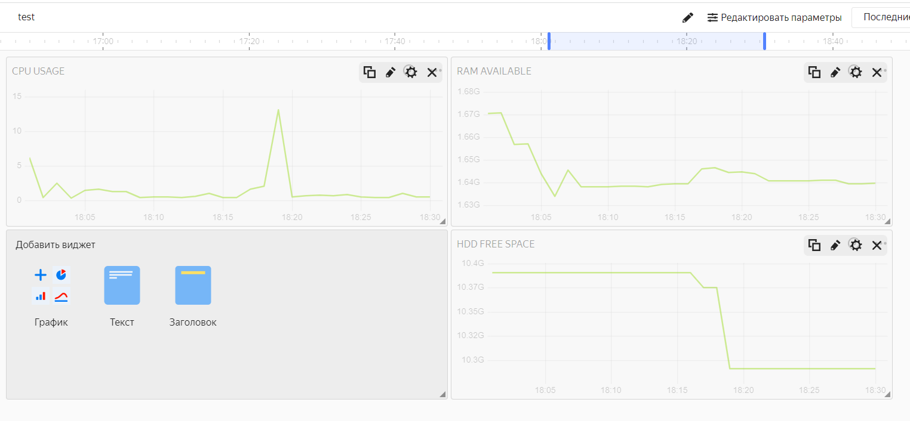

# Домашнее задание к занятию "9.1. Обзор систем IT-мониторинга" - `Неудахин Денис`

### Задание 1

`Создайте виртуальную машину в Yandex Cloud Compute Cloud, и с помощью Yandex Monitoring создайте дашборд, на котором будет видно загрузку процессора, количество занятой оперативной памяти и свободное место на жёстком диске`

---

