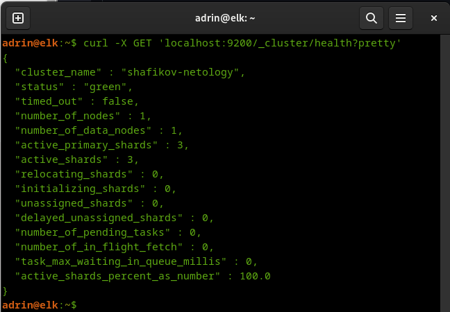
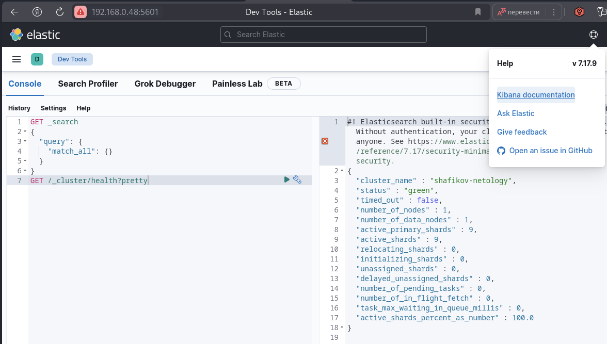

# Домашнее задание к занятию "`Название занятия`" - `Шафиков Ринат`


### Задание 1. Elasticsearch

`Установите и запустите Elasticsearch, после чего поменяйте параметр cluster_name на случайный.

Приведите скриншот команды 'curl -X GET 'localhost:9200/_cluster/health?pretty', сделанной на сервере с установленным Elasticsearch. Где будет виден нестандартный cluster_name.`

### Решение 1

```
sudo apt update && sudo apt upgrade -y
sudo apt install gnupg apt-transport-https
wget -qO - https://artifacts.elastic.co/GPG-KEY-elasticsearch | sudo apt-key add
echo "deb [trusted=yes] https://mirror.yandex.ru/mirrors/elastic/7/ stable main" | sudo tee /etc/apt/sources.list.d/elastic-7.x.list
sudo apt update && sudo apt install elasticsearch
sudo systemctl daemon-reload
sudo systemctl enable elasticsearch.service
sudo systemctl start elasticsearch.service
sudo nano /etc/elasticsearch/elasticsearch.yml
cluster.name: shafikov-netology
systemctl restart elasticsearch
```


---

### Задание 2. Kibana

`Установите и запустите Kibana.

Приведите скриншот интерфейса Kibana на странице http://<ip вашего сервера>:5601/app/dev_tools#/console, где будет выполнен запрос GET /_cluster/health?pretty.`

### Решение 2

```
sudo apt install kibana
sudo systemctl daemon-reload
sudo systemctl enable kibana.service
systemctl start kibana.service
sudo nano /etc/kibana/kibana.yml
server.host: "192.168.0.48"
http://192.168.0.48:5601/app/dev_tools#/console
GET /_cluster/health?pretty
```


---

### Задание 3. Logstash

`Установите и запустите Logstash и Nginx. С помощью Logstash отправьте access-лог Nginx в Elasticsearch.

Приведите скриншот интерфейса Kibana, на котором видны логи Nginx.`


```
sudo apt install logstash
sudo systemctl daemon-reload
sudo systemctl enable logstash.service
sudo systemctl start logstash.service
sudo apt install nginx

```

---

### Задание 4. Filebeat

`Установите и запустите Filebeat. Переключите поставку логов Nginx с Logstash на Filebeat.

Приведите скриншот интерфейса Kibana, на котором видны логи Nginx, которые были отправлены через Filebeat.`

---

### Задание 4. Доставка данных

`Настройте поставку лога в Elasticsearch через Logstash и Filebeat любого другого сервиса , но не Nginx. Для этого лог должен писаться на файловую систему, Logstash должен корректно его распарсить и разложить на поля.

Приведите скриншот интерфейса Kibana, на котором будет виден этот лог и напишите лог какого приложения отправляется.`
