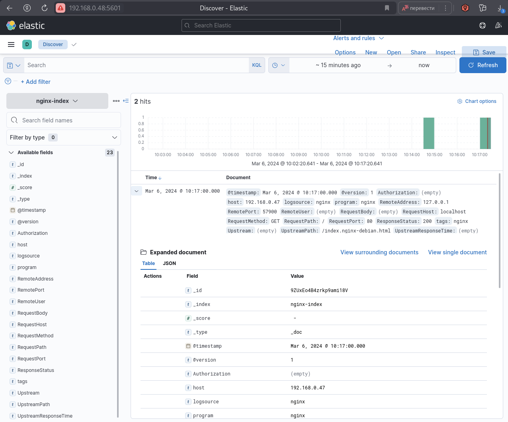
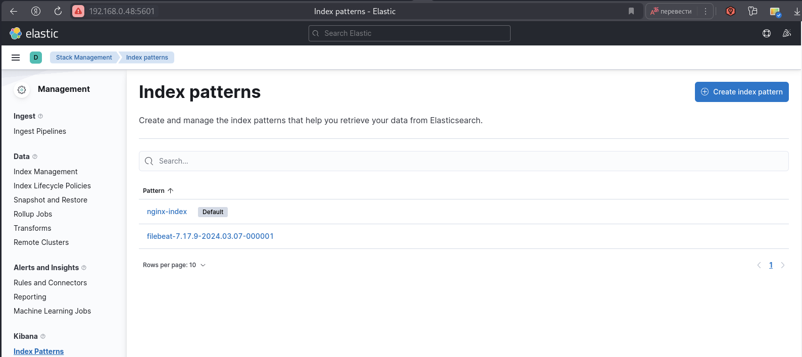
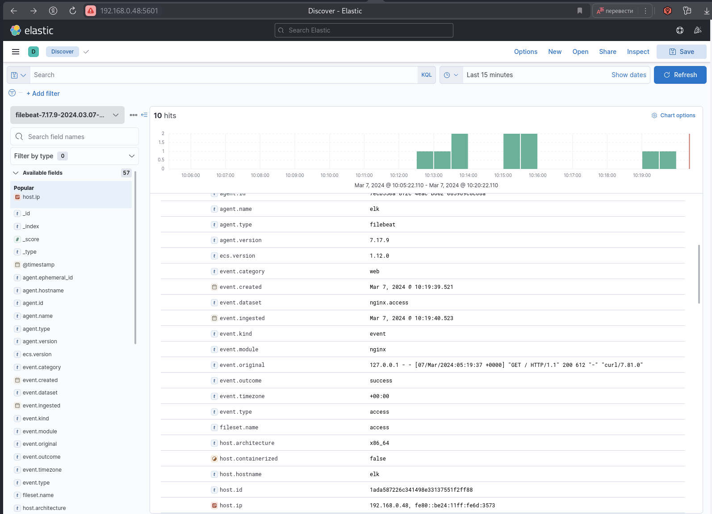

# Домашнее задание к занятию "`Название занятия`" - `Шафиков Ринат`


### Задание 1. Elasticsearch

`Установите и запустите Elasticsearch, после чего поменяйте параметр cluster_name на случайный.

Приведите скриншот команды 'curl -X GET 'localhost:9200/_cluster/health?pretty', сделанной на сервере с установленным Elasticsearch. Где будет виден нестандартный cluster_name.`

### Решение 1

```
sudo apt update && sudo apt upgrade -y
sudo apt install gnupg apt-transport-https
wget -qO - https://artifacts.elastic.co/GPG-KEY-elasticsearch | sudo apt-key add
echo "deb [trusted=yes] https://mirror.yandex.ru/mirrors/elastic/7/ stable main" | sudo tee /etc/apt/sources.list.d/elastic-7.x.list
sudo apt update && sudo apt install elasticsearch
sudo systemctl daemon-reload
sudo systemctl enable elasticsearch.service
sudo systemctl start elasticsearch.service
sudo nano /etc/elasticsearch/elasticsearch.yml
cluster.name: shafikov-netology
systemctl restart elasticsearch
```


---

### Задание 2. Kibana

`Установите и запустите Kibana.

Приведите скриншот интерфейса Kibana на странице http://<ip вашего сервера>:5601/app/dev_tools#/console, где будет выполнен запрос GET /_cluster/health?pretty.`

### Решение 2

```
sudo apt install kibana
sudo systemctl daemon-reload
sudo systemctl enable kibana.service
systemctl start kibana.service
sudo nano /etc/kibana/kibana.yml
server.host: "192.168.0.48"
http://192.168.0.48:5601/app/dev_tools#/console
GET /_cluster/health?pretty
```


---

### Задание 3. Logstash

`Установите и запустите Logstash и Nginx. С помощью Logstash отправьте access-лог Nginx в Elasticsearch.

Приведите скриншот интерфейса Kibana, на котором видны логи Nginx.`

### Решение 3

```
sudo apt install logstash
sudo systemctl daemon-reload
sudo systemctl enable logstash.service
sudo systemctl start logstash.service
sudo nano /etc/logstash/conf.d/logstash.conf
```
```
input {
  syslog {
    port => 5555
    tags => "nginx"
  }
}

filter{

    json{
        source => "message"
    }

    date {
       match  => ["RequestTime","ISO8601"]
    }

    mutate {
        remove_field => ["message","timestamp","RequestTime","facility","facility_label","severity","severity_label","priority"]
    }

}

output {
if [program] == "nginx" {
    elasticsearch {
      hosts => ["http://localhost:9200"]
      index => "nginx-index"
    }
  }
}
```
Management - Stack Management - Kibana - Index patterns - Create index pattern - Your index pattern (cp  nginx-index) - Create index pattern


На другом хосте установим nginx

```
sudo apt install nginx
```
```
sudo nano /etc/nginx/nginx.conf
```
```
events {
        worker_connections 1024;
}

http {
        include /etc/nginx/mime.types;
        include /etc/nginx/conf.d/*.conf;
        include /etc/nginx/sites-enabled/default;
        default_type application/octet-stream;

        log_format json escape=json
                '{'
                        '"Authorization":"$http_authorization",'
                        '"RequestTime":"$time_iso8601",'
                        '"RemoteAddress":"$remote_addr",'
                        '"RemotePort":"$remote_port",'
                        '"RemoteUser":"$remote_user",'
                        '"RequestHost":"$host",'
                        '"RequestPort":"$server_port",'
                        '"RequestMethod":"$request_method",'
                        '"RequestPath":"$request_uri",'
                        '"RequestBody":"$request_body",'
                        '"ResponseStatus":"$status",'
                        '"Upstream":"$upstream_addr",'
                        '"UpstreamPath":"$uri",'
                        '"UpstreamResponseTime":"$upstream_response_time"'
                '}';

        access_log syslog:server=172.16.0.150:5555 json;
}
```


---

### Задание 4. Filebeat

`Установите и запустите Filebeat. Переключите поставку логов Nginx с Logstash на Filebeat.

Приведите скриншот интерфейса Kibana, на котором видны логи Nginx, которые были отправлены через Filebeat.`

### Решение 4

```
sudo apt install filebeat
sudo systemctl daemon-reload
sudo systemctl enable filebeat.service
sudo nano /etc/logstash/conf.d/logstash.conf
```
```
input {
  beats {
    port => 5400
    host => "0.0.0.0"
    tags => "nginx-filebeat"
  }
}

filter{

    json{
        source => "message"
    }

    date {
       match  => ["RequestTime","ISO8601"]
    }

    mutate {
        remove_field => ["message","timestamp","RequestTime","facility","facility_label","severity","severity_label","priority"]
    }

}

output {
if [program] == "nginx" {
    elasticsearch {
      hosts => ["192.168.0.48:9200"]
      index => "nginx_logs"
    }
  }
}
```
```
sudo filebeat modules enable nginx
```


