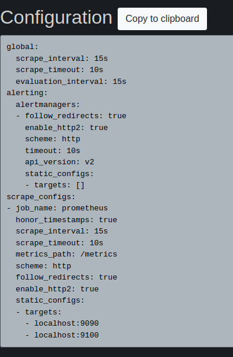
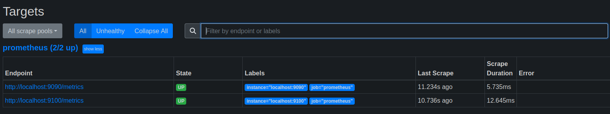

# Домашнее задание к занятию "Система мониторинга Prometheus" - Пешева Ирина

### Задание 1
Установите Prometheus.

#### Процесс выполнения
1. Выполняя задание, сверяйтесь с процессом, отражённым в записи лекции
2. Создайте пользователя prometheus
3. Скачайте prometheus и в соответствии с лекцией разместите файлы в целевые директории
4. Создайте сервис как показано на уроке
5. Проверьте что prometheus запускается, останавливается, перезапускается и отображает статус с помощью systemctl

#### Требования к результату
- [ ] Прикрепите к файлу README.md скриншот systemctl status prometheus, где будет написано: prometheus.service — Prometheus Service Netology Lesson 9.4 — [Ваши ФИО]
### Решение 1
* Пользователь создан;
* скачан архив с последней версией Prometheus (2.46), разархивирован; 
* файлы prometheus, promtool сложены в /usr/local/bin; 
* директории console_libraries, consoles и файл prometheus.yml сложены в /etc/prometheus/; 
* указанным файлам и /var/lib/prometheus/ добавлен доступ пользователю prometheus;
* cервис успешно создан и запущен.

---
### Задание 2
Установите Node Exporter.

#### Процесс выполнения
1. Выполняя ДЗ сверяйтесь с процессом отражённым в записи лекции.
3. Скачайте node exporter приведённый в презентации и в соответствии с лекцией разместите файлы в целевые директории
4. Создайте сервис, как показано на уроке
5. Проверьте что node exporter запускается, останавливается, перезапускается и отображает статус с помощью systemctl

#### Требования к результату
- [ ] Прикрепите к файлу README.md скриншот systemctl status node-exporter, где будет написано: node-exporter.service — Node Exporter Netology Lesson 9.4 — [Ваши ФИО]
### Решение 2
* Скачан архив с последней версией Node Exporter (1.6.1), разархивирован;
* файлы архива скопированы в /etc/prometheus/node_exporter;
* пользователю prometheus добавлены права на использование указанной директории;
* создан, добавлен и запущен сервис node_exporter.service.

---
### Задание 3
Подключите Node Exporter к серверу Prometheus.

#### Процесс выполнения
1. Выполняя ДЗ сверяйтесь с процессом отражённым в записи лекции.
2. Отредактируйте prometheus.yaml, добавив в массив таргетов установленный в задании 2 node exporter
3. Перезапустите prometheus
4. Проверьте что он запустился

#### Требования к результату
- [ ] Прикрепите к файлу README.md скриншот конфигурации из интерфейса Prometheus вкладки Status > Configuration
- [ ] Прикрепите к файлу README.md скриншот из интерфейса Prometheus вкладки Status > Targets, чтобы было видно минимум два эндпоинта
### Решение 3

* Файл /etc/prometheus/prometheus.yml отредактирован;
* "цель" localhost:9100 отображается в конфигурации и в списке:

---

## Дополнительные задания (со звездочкой*)

Эти задания дополнительные (не обязательные к выполнению) и никак не повлияют на получение вами зачета по этому домашнему заданию. Вы можете их выполнить, если хотите глубже и/или шире разобраться в материале.

### Задание 4
Установите Grafana.

#### Требования к результату
- [ ] Прикрепите к файлу README.md скриншот левого нижнего угла интерфейса, чтобы при наведении на иконку пользователя были видны ваши ФИО
### Решение 4

Ныне профиль переехал в правый верхний угол:

---
### Задание 5
Интегрируйте Grafana и Prometheus.

#### Требования к результату
- [ ] Прикрепите к файлу README.md скриншот дашборда (ID:11074) с поступающими туда данными из Node Exporter

### Решение 5

Добавлен дашборд, ипортированный по id, с указанием prometheus в качестве источника:

