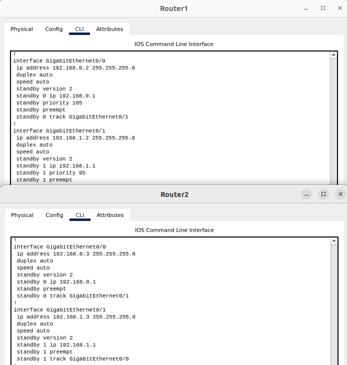
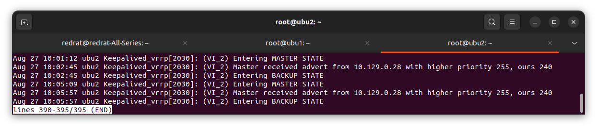

# Домашнее задание к занятию "Disaster Recovery. FHRP и Keepalived" - Пешева Ирина


### Задание 1
- Дана схема для Cisco Packet Tracer, рассматриваемая в лекции.
- На данной схеме уже настроено отслеживание интерфейсов маршрутизаторов Gi0/1 (для нулевой группы)
- Необходимо аналогично настроить отслеживание состояния интерфейсов Gi0/0 (для первой группы).
- Для проверки корректности настройки, разорвите один из кабелей между одним из маршрутизаторов и Switch0 и запустите ping между PC0 и Server0.
- На проверку отправьте получившуюся схему в формате pkt и скриншот, где виден процесс настройки маршрутизатора.
### Решение 1

Изначально настройки интерфесов и групп следующие:


При обрыве связи пакет не проходит от сервера к ПК и адрес не переназначается:


И это, в общем-то, единственный разрыв в этом контуре, при котором оставшийся роутер не хочет принимать на себя обязательства.
При отключении роутеров оставшийся без вопросов принимает на себя нагрузку, так что починить нужно только этот момент.

Для начала на Rounter1 для второй группы назначим понижение приоритета при отключении Gig0/0. Это, конечно, работает, но приоритет 90 всё ещё больше 50, как ни крути, да ещё и у Router0 не назначен preempt. Исправляем. Итого конфиги:



Вот теперь всё хорошо:


И сообщение проходит:


---
### Задание 2
- Запустите две виртуальные машины Linux, установите и настройте сервис Keepalived как в лекции, используя пример конфигурационного файла.
- Настройте любой веб-сервер (например, nginx или simple python server) на двух виртуальных машинах
- Напишите Bash-скрипт, который будет проверять доступность порта данного веб-сервера и существование файла index.html в root-директории данного веб-сервера.
- Настройте Keepalived так, чтобы он запускал данный скрипт каждые 3 секунды и переносил виртуальный IP на другой сервер, если bash-скрипт завершался с кодом, отличным от нуля (то есть порт веб-сервера был недоступен или отсутствовал index.html). Используйте для этого секцию vrrp_script
- На проверку отправьте получившейся bash-скрипт и конфигурационный файл keepalived, а также скриншот с демонстрацией переезда плавающего ip на другой сервер в случае недоступности порта или файла index.html
### Решение 2

#### Настройка keepalived

Созданы две вирутальные машины с внутренними адресами 10.129.0.28/24 и 10.129.0.10/24 соответственно.

Сервис keepalived установлен на обе ВМ, добавлен в автозагрузку и запущен. 

В обоих добавлен файл /etc/keepalived/keepalived.conf. Содержимое файлов на ВМ
```
vrrp_instance VI_1 {
        state MASTER
        interface eth0
        virtual_router_id 15
        priority 255
        advert_int 1

        virtual_ipaddress {
              10.129.0.15/24
        }
	
	  unicast_peer {
		  10.129.0.10   # BACKUP_IP_VALUE
	  }
}
```
и
```
vrrp_instance VI_2 {
        state BACKUP
        interface eth0
        virtual_router_id 15
        priority 240
        advert_int 1

        virtual_ipaddress {
              10.129.0.15/24
        }
	  unicast_peer {
		  10.129.0.28   # MASTER_IP_VALUE 
	  }
}
```
соответственно.

#### Настройка nginx

Устанавливаем nginx -- вот, в общем-то, и вся настройка.


#### Создание bash-скрипта

Bash-скрипт /usr/local/bin/check_server_availability.sh будет возвращать 1, если порт 80 недоступен, 2, если в root-директории нет файла index.html и 0, если таких проблем нет.

```bash
#!/bin/bash

host=localhost
port=80
file_path=/index.html


nc -z $host $port

port_is_open=$?

if [[ port_is_open -eq 0 && -f "$file_path" ]]; then
    exit 0
else
    exit 1
fi
```

Проверяем на одной из машин:


Работает.

#### Настройка запуска скрипта в keepalived

Модифицируем файл /etc/keepalived/keepalived.conf:

```
vrrp_script check_availability {
	script "/usr/local/bin/check_server_availability.sh"
	interval 3
}

vrrp_instance VI_1 {
        state MASTER
        interface eth0
        virtual_router_id 15
        priority 255
        advert_int 1

        virtual_ipaddress {
              10.129.0.15/24
        }

	track_script {
		check_availability
	}
	
	unicast_peer {
		10.129.0.10   # BACKUP_IP_VALUE
	}
}
```

Проверяем. Роняем nginx, затем восстанавливаем:


Ip 127.10.0.15 "переехал" на вторую ВМ, затем вернулся на первую:


Удаляем и восстанавливаем файл:


Картина та же.

В логах можно увидеть переключения статусов машин:





