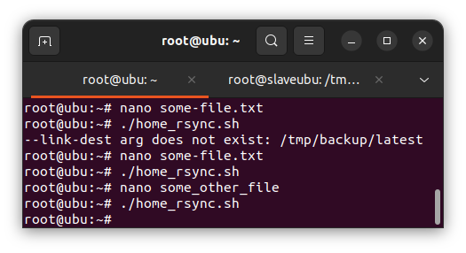
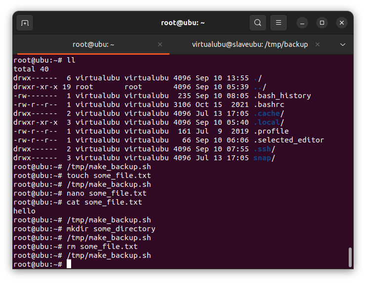

# Домашнее задание к занятию "Резервное копирование" - Пешева Ирина


### Задание 1

- Составьте команду rsync, которая позволяет создавать зеркальную копию домашней директории пользователя в директорию `/tmp/backup`.
- Необходимо исключить из синхронизации все директории, начинающиеся с точки (скрытые).
- Необходимо сделать так, чтобы rsync подсчитывал хэш-суммы для всех файлов, даже если их время модификации и размер идентичны в источнике и приемнике.
- На проверку направить скриншот с командой и результатом ее выполнения.

### Решение 1

```
rsync -a --delete --exclude '.*' -c ~/ /tmp/backup
```

где:
- -a — включение архивного режима;
- --delete — включение зеркальной копии;
- --exclude '.*' — исключение из копирования скрытых файлов;
- -с — включение обязательного подсчёта контрольной суммы.


---
### Задание 2

- Написать скрипт и настроить задачу на регулярное резервное копирование домашней директории пользователя с помощью rsync и cron.
- Резервная копия должна быть полностью зеркальной.
- Резервная копия должна создаваться раз в день, в системном логе должна появляться запись об успешном или неуспешном выполнении операции.
- Резервная копия размещается локально, в директории `/tmp/backup`.
- На проверку направить файл crontab и скриншот с результатом работы утилиты.

### Решение 2

Несколько упростим себе жизнь и проделаем все настройки для root-пользователя.

Для начала зададим поминутный вызов скрипта и проверим, работает ли он вообще:


Работает.

Теперь проверим логирование и отслеживание ошибок. Зададим несуществующую директорию для копирования:


Результат бэкапа логируется.

#### Итого

Скрипт:

```bash
#!/bin/bash

rsync -a --delete ~/ /tmp/backup

backup_status=$?

if [ $backup_status -eq 0 ]; then
    logger [${BASH_SOURCE}] Backup is successful
else
    logger [${BASH_SOURCE}] Backup failed
fi
exit $backup_status
```

crontab:
```
@daily /root/home_rsync.sh
```
Он же в [файле](10.3.2/root).

---

## Дополнительные задания (со звездочкой*)

Эти задания дополнительные (не обязательные к выполнению) и никак не повлияют на получение вами зачета по этому домашнему заданию. Вы можете их выполнить, если хотите глубже и/или шире разобраться в материале.

### Задание 3

- Настройте ограничение на используемую пропускную способность rsync до 1 Мбит/c.
- Проверьте настройку, синхронизируя большой файл между двумя серверами.
- На проверку направьте команду и результат ее выполнения в виде скриншота.

### Решение 3

Для проверки синхронизации передадим some_big_file с скоростью 125Кбайт/с на второй сервер в директорию /tmp:

```
rsync -aW --progress --bwlimit=125 files/some_big_file  virtualubu@10.129.0.15:/tmp
```

Синхронизируем сначала файл без ограничения скорости, а затем файл того же размера с ограничением:


Файл успешно доставлен на второй сервер:


---

### Задание 4

- Напишите скрипт, который будет производить инкрементное резервное копирование домашней директории пользователя с помощью rsync на другой сервер.
- Скрипт должен удалять старые резервные копии (сохранять только последние 5 штук).
- Напишите скрипт управления резервными копиями, в нем можно выбрать резервную копию и данные восстановятся к состоянию на момент создания данной резервной копии.
- На проверку направьте скрипт и скриншоты, демонстрирующие его работу в различных сценариях.

### Решение 4

#### Инкрементное копирование

Эта часть честно украдена из интернета, так как сама про --link-dest бы в жизни не догадалась.

Внесём изменения в скрипт из 2 задания.

Скрипт:

``` bash
#!/bin/bash


SOURCE_DIRECTORY=~/

BACKUP_SERVER_IP="10.129.0.15"
BACKUP_SERVER_USER="virtualubu"
BACKUP_DIRECTORY="/tmp/backup"

LATEST_BACKUP_LINK="${BACKUP_DIRECTORY}/latest"

CURRENT_TIME=`date +%Y-%m-%d_%T`

DESTINATION_PATH="${BACKUP_DIRECTORY}/${CURRENT_TIME}"
DESTINATION_FULL_PATH="${BACKUP_SERVER_USER}@${BACKUP_SERVER_IP}:${DESTINATION_PATH}"


rsync -a --delete "${SOURCE_DIRECTORY}" --link-dest "${LATEST_BACKUP_LINK}" "${DESTINATION_FULL_PATH}"

backup_status=$?

if [ $backup_status -eq 0 ]; then

    ssh "${BACKUP_SERVER_USER}@${BACKUP_SERVER_IP}" "rm -rf ${LATEST_BACKUP_LINK}; \
        ln -s ${DESTINATION_PATH} ${LATEST_BACKUP_LINK}"

    backup_status=$?

    if [ $backup_status -eq 0 ]; then
        logger [${BASH_SOURCE}] Backup is successful
    fi

else
    logger [${BASH_SOURCE}] Backup failed
fi
exit $backup_status
```

Что происходит:
* как обычно, на сервер закидываются все изменённые файлы;
* но теперь каждый раз они записываются в новую папку (папка получает значение по текущему времени);
* при этом создаются жёсткие ссылки на неизменённые файлы из папки, на которую ведёт мягкая ссылка latest;
* после чего мягкая ссылка переназначается и ведёт уже на последнее изменение.

Таким образом новые файлы создаются только для файлов, изменившихся с последнего бэкапа.

Проверяем:




По номеру ноды можно отследить, создан ли новый файл.
* Сначала заливается первая версия на сервер.
* Затем вносятся изменения в файл some-file.txt. Изменения заливаются на бэкап-сервер. У файлов остаются те же номера нодов, а для some-file.txt создаётся новый файл с новым номером ноды.
* Теперь вносятся изменния в файл some_other_file. После создания бэкапа файл some-file.txt остаётся тот же, а some_other_file меняется.

#### Добавляем удаление накопившихся файлов

Для удаления файлов используем команду, удаляющую все файлы, кроме 6 последних (Спорное решение, составлять число из 5 бэкапов и 1 ссылки. Можно было бы удалять по паттерну, но этот паттерн надо бы создать. Удалять только директории также не выглядит универсальным решением.).

```
ssh "${BACKUP_SERVER_USER}@${BACKUP_SERVER_IP}" "ls -d ${BACKUP_DIRECTORY}/*| head -n -$((NUMBER_OF_BACKUP_COPIES+1)) | xargs rm -rf"
```

Чтобы не усложнять скрипт, предположим, что удаление устаревших копий — желательное действие, поэтому нас не так интересует, успешно ли оно прошло, а удаляющий файлы скрипт не интересует, успешно ли прошёл бэкап.

#### Восстановление из резервной копии

Для восстановления файлов сделаем выгрузку имён доступных бэкапов с возможностью выбора нужного; восстановление будет зеркальным.

```bash
#!/bin/bash

BACKUP_SERVER_IP="10.129.0.15"
BACKUP_SERVER_USER="virtualubu"
BACKUP_DIRECTORY="/tmp/backup"

LATEST_BACKUP_LINK="${BACKUP_DIRECTORY}/latest"

DIRECTORY_TO_RESTORE=~/

backups=($(ssh ${BACKUP_SERVER_USER}@${BACKUP_SERVER_IP} "ls ${BACKUP_DIRECTORY}"))

select backup in "${backups[@]}"; do
    rsync -a --delete "${BACKUP_SERVER_USER}@${BACKUP_SERVER_IP}:${BACKUP_DIRECTORY}/${backup}/" "${DIRECTORY_TO_RESTORE}"

    restore_status=$?

    if [ $restore_status -eq 0 ]; then
        logger [${BASH_SOURCE}] Backup restore is successful
        echo "Файлы успешно восстановлены из бэкапа ${backup}"
    else
        logger [${BASH_SOURCE}] Backup restore failed
        echo "Не удалось восстановить файлы"
    fi

    exit $restore_status
done

```

#### Проверка

Наведём шороху: 
* сначала директория не будет содержать посторонних файлов;
* создадим файл some_file.txt;
* запишем в него hello;
* создадим директорию some_directory;
* удалим файл some_file.txt.

На каждом этапе делаем бэкап:



Просматриваем получившиеся бэкапы:


Похоже на правду.

Создаём файл some_other_file и восстанавливаемся с разных бэкапов:


Вроде работает. Проверим пограничные случаи: пользователь ввёл неправильное число и бэкап магическим образом исчез, пока мы выбирали из меню:


Как-то красиво это всё не обрабатывается, но и файлы не затираются.

#### Скрипты

[Создать бэкап](10.3.4/make_backup.sh)

[Восстановить из бэкапа](10.3.4/restrore_from.sh)