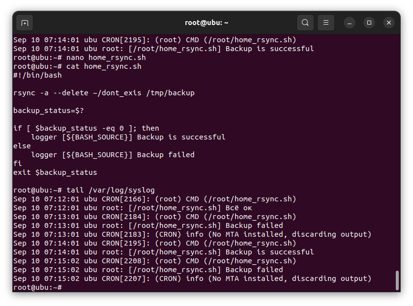

# Домашнее задание к занятию "Резервное копирование" - Пешева Ирина


### Задание 1

- Составьте команду rsync, которая позволяет создавать зеркальную копию домашней директории пользователя в директорию `/tmp/backup`
- Необходимо исключить из синхронизации все директории, начинающиеся с точки (скрытые)
- Необходимо сделать так, чтобы rsync подсчитывал хэш-суммы для всех файлов, даже если их время модификации и размер идентичны в источнике и приемнике.
- На проверку направить скриншот с командой и результатом ее выполнения

### Решение 1

```
rsync -a --delete --exclude '.*' -c ~/ /tmp/backup
```

где:
- -a — включение архивного режима;
- --delete — включение зеркальной копии;
- --exclude '.*' — исключение из копирования скрытых файлов;
- -с — включение обязательного подсчёта контрольной суммы.


---
### Задание 2

- Написать скрипт и настроить задачу на регулярное резервное копирование домашней директории пользователя с помощью rsync и cron.
- Резервная копия должна быть полностью зеркальной
- Резервная копия должна создаваться раз в день, в системном логе должна появляться запись об успешном или неуспешном выполнении операции
- Резервная копия размещается локально, в директории `/tmp/backup`
- На проверку направить файл crontab и скриншот с результатом работы утилиты.

### Решение 2

Несколько упростим себе жизнь и проделаем все настройки для root-пользователя.

Для начала зададим поминутный вызов скрипта и проверим, работает ли он вообще:


Работает.

Теперь проверим логирование и отслеживание ошибок. Зададим несуществующую директорию для копирования:



Результат бэкапа логируется.

#### Итого

Скрипт:

```bash
#!/bin/bash

rsync -a --delete ~/ /tmp/backup

backup_status=$?

if [ $backup_status -eq 0 ]; then
    logger [${BASH_SOURCE}] Backup is successful
else
    logger [${BASH_SOURCE}] Backup failed
fi
exit $backup_status
```

crontab:
```
@daily /root/home_rsync.sh
```
Он же в [файле](10.3.2/root).

---

## Дополнительные задания (со звездочкой*)

Эти задания дополнительные (не обязательные к выполнению) и никак не повлияют на получение вами зачета по этому домашнему заданию. Вы можете их выполнить, если хотите глубже и/или шире разобраться в материале.

### Задание 3

- Настройте ограничение на используемую пропускную способность rsync до 1 Мбит/c
- Проверьте настройку, синхронизируя большой файл между двумя серверами
- На проверку направьте команду и результат ее выполнения в виде скриншота

### Решение 3

---

### Задание 4

- Напишите скрипт, который будет производить инкрементное резервное копирование домашней директории пользователя с помощью rsync на другой сервер
- Скрипт должен удалять старые резервные копии (сохранять только последние 5 штук)
- Напишите скрипт управления резервными копиями, в нем можно выбрать резервную копию и данные восстановятся к состоянию на момент создания данной резервной копии.
- На проверку направьте скрипт и скриншоты, демонстрирующие его работу в различных сценариях.

### Решение 4


