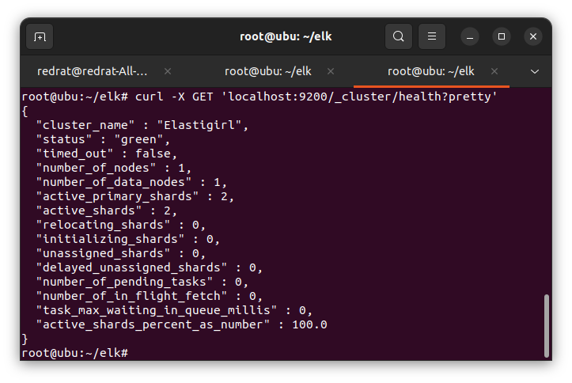
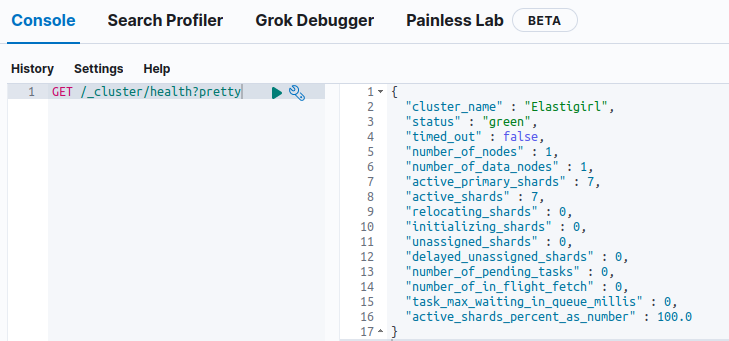
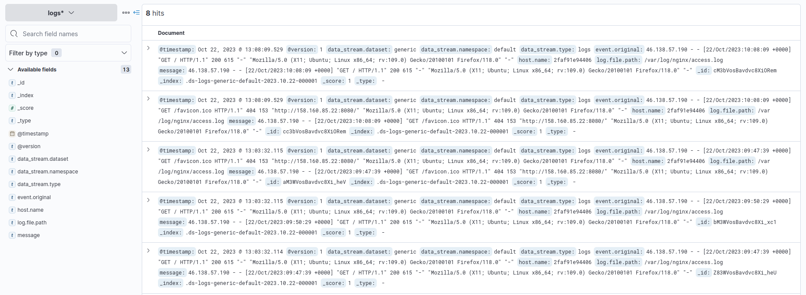
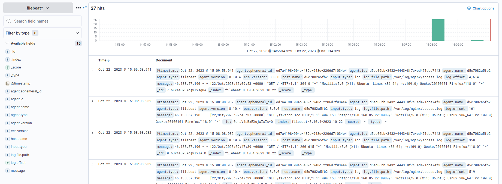
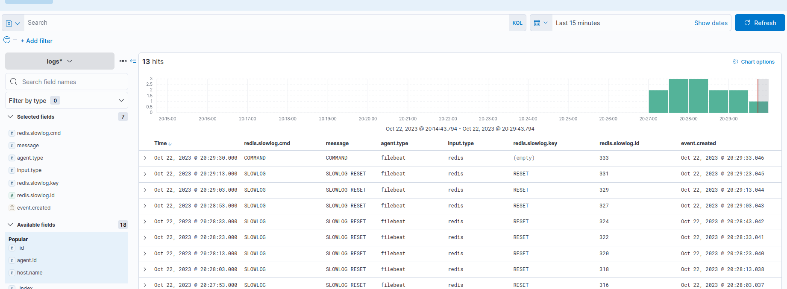

# Домашнее задание к занятию "ELK" - Пешева Ирина


### Задание 1

Установите и запустите Elasticsearch, после чего поменяйте параметр cluster_name на случайный. 

*Приведите скриншот команды 'curl -X GET 'localhost:9200/_cluster/health?pretty'', сделанной на сервере с установленным Elasticsearch. Где будет виден нестандартный cluster_name*.

### Решение 1
Cluster_name в файле elasticsearch.yml был заменён с elasticsearch на Elastigirl.

```yml
cluster:
  name: Elastigirl
```



---
### Задание 2

Установите и запустите Kibana.

*Приведите скриншот интерфейса Kibana на странице http://<ip вашего сервера>:5601/app/dev_tools#/console, где будет выполнен запрос GET /_cluster/health?pretty*.

### Решение 2



---
### Задание 3

Установите и запустите Logstash и Nginx. С помощью Logstash отправьте access-лог Nginx в Elasticsearch. 

*Приведите скриншот интерфейса Kibana, на котором видны логи Nginx.*

### Решение 3

В docker-compose добавлены контейнеры с logstash и nginx; через общий volume объединены их директории /var/log/nginx.
В Kibana добавлен index logs* (для logstash название индекса не добавлялось).



---

### Задание 4

Установите и запустите Filebeat. Переключите поставку логов Nginx с Logstash на Filebeat. 

*Приведите скриншот интерфейса Kibana, на котором видны логи Nginx, которые были отправлены через Filebeat.*

### Решение 4

Был настроен контейнер с filebeat, в файле filebeat.yml были указаны настройки для забора и отправки логов, в том числе имя индекса.



---

## Дополнительные задания (со звездочкой*)

Эти задания дополнительные (не обязательные к выполнению) и никак не повлияют на получение вами зачета по этому домашнему заданию. Вы можете их выполнить, если хотите глубже и/или шире разобраться в материале.

### Задание 5

Настройте поставку лога в Elasticsearch через Logstash и Filebeat любого другого сервиса, но не Nginx. 
Для этого лог должен писаться на файловую систему, Logstash должен корректно его распарсить и разложить на поля. 

*Приведите скриншот интерфейса Kibana, на котором будет виден этот лог и напишите лог какого приложения отправляется.*

### Решение 5

Для проверки работы был добавлен контейнер с Redis (в нём же изменены параметры того, что считать slowlog -- в текущем исполнении всё).
Filebeat мониторит slowlog и отправляет его в Logstash.
Lostash отправляет это в Elasticsearch.

