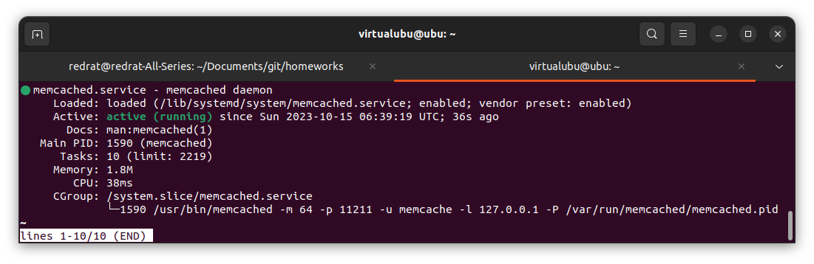

# Домашнее задание к занятию "Кеширование Redis/memcached" - Пешева Ирина

### Задание 1. Кеширование 

Приведите примеры проблем, которые может решить кеширование. 

*Приведите ответ в свободной форме.*

### Решение 1

Кеширование призвано решать проблемы с производительностью и нагрузкой. Исходя из этого можно придумать следующие проблемы и героически их решить надеясь, что данные не изменяются часто:
* Частая подгрузка больших, часто используемых файлов на сайте (например, баннеры, карточки товаров) – добавляем кеширование на стороне пользователя.
* Выполнение сложных запросов к БД – кешируем готовые значения и извлекаем их.
* Частый запрос одних и те же данных, например на главной странице того же сайта, постоянная проверка необходимости вывода опроса/предупреждения – кешируем и не собираем их каждый раз.
* Медленно выполняются операции извлечения данных – кешируем, берём их теперь поближе.

---
### Задание 2. Memcached

Установите и запустите memcached.

*Приведите скриншот systemctl status memcached, где будет видно, что memcached запущен.*

### Решение 2

---
### Задание 3. Удаление по TTL в Memcached

Запишите в memcached несколько ключей с любыми именами и значениями, для которых выставлен TTL 5. 

*Приведите скриншот, на котором видно, что спустя 5 секунд ключи удалились из базы.*

### Решение 3

---

### Задание 4. Запись данных в Redis

Запишите в Redis несколько ключей с любыми именами и значениями. 

*Через redis-cli достаньте все записанные ключи и значения из базы, приведите скриншот этой операции.*

### Решение 4

## Дополнительные задания (со звездочкой*)

Эти задания дополнительные (не обязательные к выполнению) и никак не повлияют на получение вами зачета по этому домашнему заданию. Вы можете их выполнить, если хотите глубже и/или шире разобраться в материале.

### Задание 5. Работа с числами 

Запишите в Redis ключ key5 со значением типа "int" равным числу 5. Увеличьте его на 5, чтобы в итоге в значении лежало число 10.  

*Приведите скриншот, где будут проделаны все операции и будет видно, что значение key5 стало равно 10.*

### Решение 5

