# Домашнее задание к занятию "Работа с данными (DDL/DML)" - Пешева Ирина


### Задание 1

1.1. Поднимите чистый инстанс MySQL версии 8.0+. Можно использовать локальный сервер или контейнер Docker.

1.2. Создайте учётную запись sys_temp. 

1.3. Выполните запрос на получение списка пользователей в базе данных. (скриншот)

1.4. Дайте все права для пользователя sys_temp. 

1.5. Выполните запрос на получение списка прав для пользователя sys_temp. (скриншот)

1.6. Переподключитесь к базе данных от имени sys_temp.

Для смены типа аутентификации с sha2 используйте запрос: 
```sql
ALTER USER 'sys_test'@'localhost' IDENTIFIED WITH mysql_native_password BY 'password';
```
1.6. По ссылке https://downloads.mysql.com/docs/sakila-db.zip скачайте дамп базы данных.

1.7. Восстановите дамп в базу данных.

1.8. При работе в IDE сформируйте ER-диаграмму получившейся базы данных. При работе в командной строке используйте команду для получения всех таблиц базы данных. (скриншот)

*Результатом работы должны быть скриншоты обозначенных заданий, а также простыня со всеми запросами.*

### Решение 1

1. Поднимите чистый инстанс MySQL версии 8.0+. Можно использовать локальный сервер или контейнер Docker.

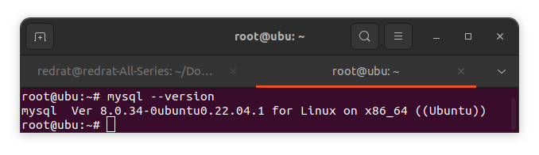

2. Создайте учётную запись sys_temp.

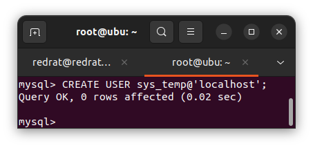

3. Выполните запрос на получение списка пользователей в базе данных. (скриншот)

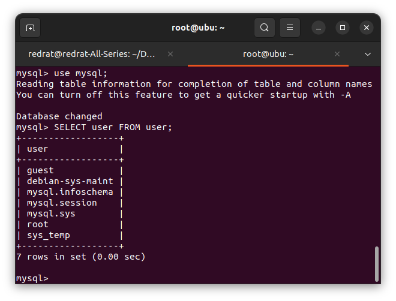

4. Дайте все права для пользователя sys_temp. 

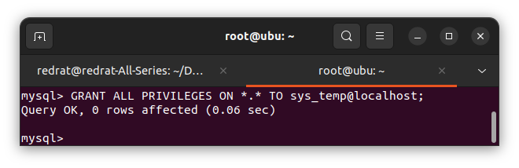

5. Выполните запрос на получение списка прав для пользователя sys_temp. (скриншот)

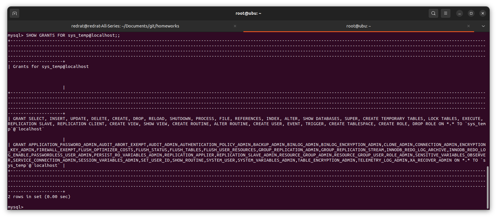

6. Переподключитесь к базе данных от имени sys_temp.

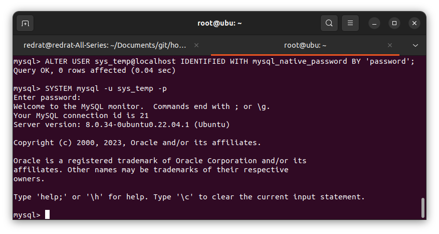

Либо "выйти и войти нормально":

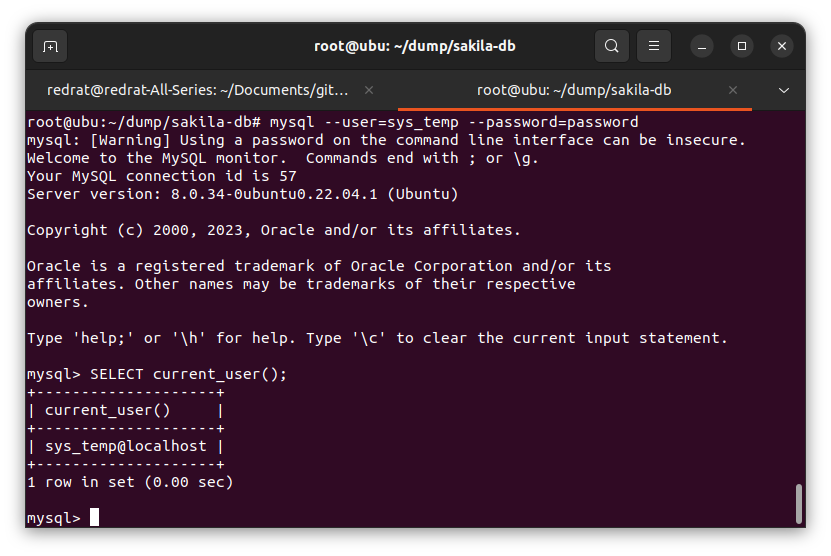

7. Восстановите дамп в базу данных.

Подготавливаем БД:

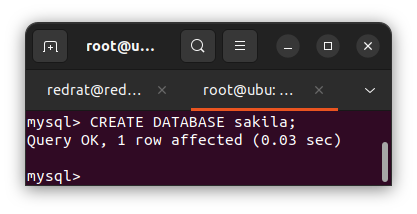

Загружаем:

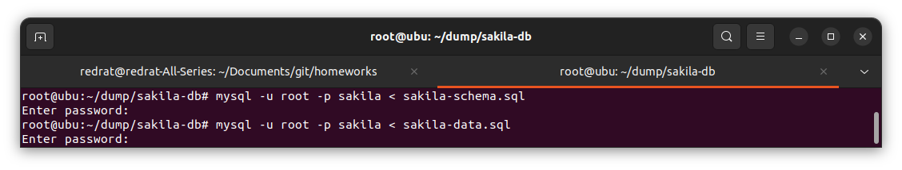

8. При работе в IDE сформируйте ER-диаграмму получившейся базы данных. При работе в командной строке используйте команду для получения всех таблиц базы данных. (скриншот)

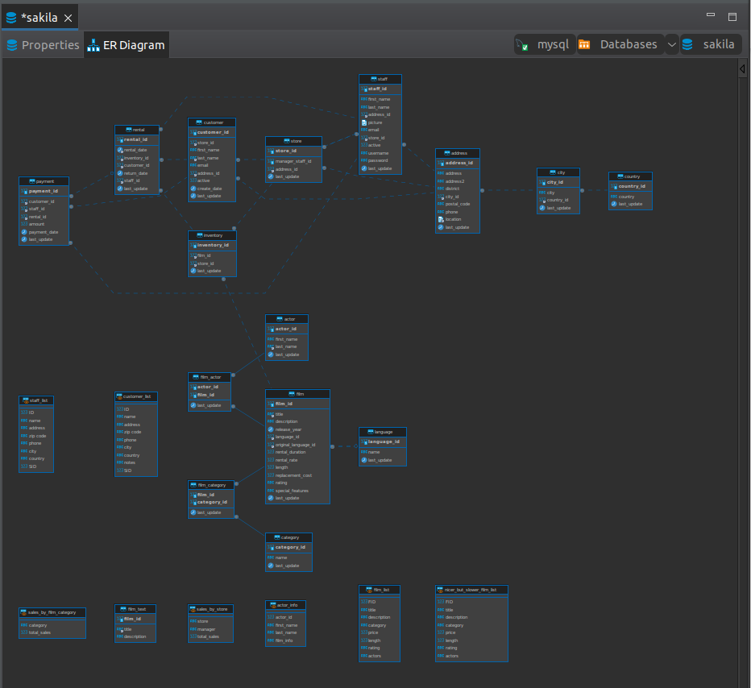

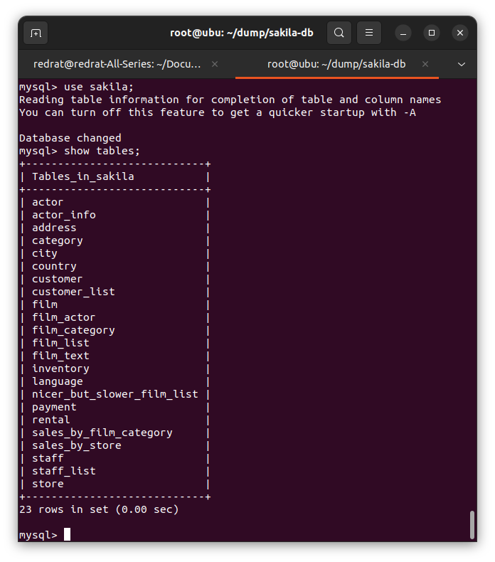

---

Команды:

```mysql
CREATE USER sys_temp@localhost;

USE mysql;
SELECT user FROM user;

SHOW GRANTS FOR sys_temp@localhost;

GRANT ALL PRIVILEGES ON *.* TO sys_temp@localhost;

ALTER USER sys_temp@localhost IDENTIFIED WITH mysql_native_password BY 'password';
SYSTEM mysql -u sys_temp -p;
SELECT current_user();

CREATE DATABASE sakila;
```  

```console
mysql -u root -p sakila < sakila-schema.sql
mysql -u root -p sakila < sakila-data.sql 
```

```mysql
USE sakila;
SHOW TABLES;
```

---
### Задание 2

Составьте таблицу, используя любой текстовый редактор или Excel, в которой должно быть два столбца: в первом должны быть названия таблиц восстановленной базы, во втором названия первичных ключей этих таблиц. Пример: (скриншот/текст)
```
Название таблицы | Название первичного ключа
customer         | customer_id
```

### Решение 2

| Название таблицы | Первичный ключ |
| --- | --- |
| actor | actor_id |
| address | address_id |
| category | category_id |
| city | city_id |
| country | country_id |
| customer | customer_id |
| film | film_id |
| film_actor | actor_id, film_id |
| film_category | film_id, category_id |
| film_text | film_id |
| inventory | inventory_id |
| language | language_id |
| payment | payment_id |
| rental | rental_id |
| staff | staff_id |
| store | store_id |

---

## Дополнительные задания (со звездочкой*)

Эти задания дополнительные (не обязательные к выполнению) и никак не повлияют на получение вами зачета по этому домашнему заданию. Вы можете их выполнить, если хотите глубже и/или шире разобраться в материале.

### Задание 3

3.1. Уберите у пользователя sys_temp права на внесение, изменение и удаление данных из базы sakila.

3.2. Выполните запрос на получение списка прав для пользователя sys_temp. (скриншот)

*Результатом работы должны быть скриншоты обозначенных заданий, а также простыня со всеми запросами.*

### Решение 3

1. Уберите у пользователя sys_temp права на внесение, изменение и удаление данных из базы sakila.


