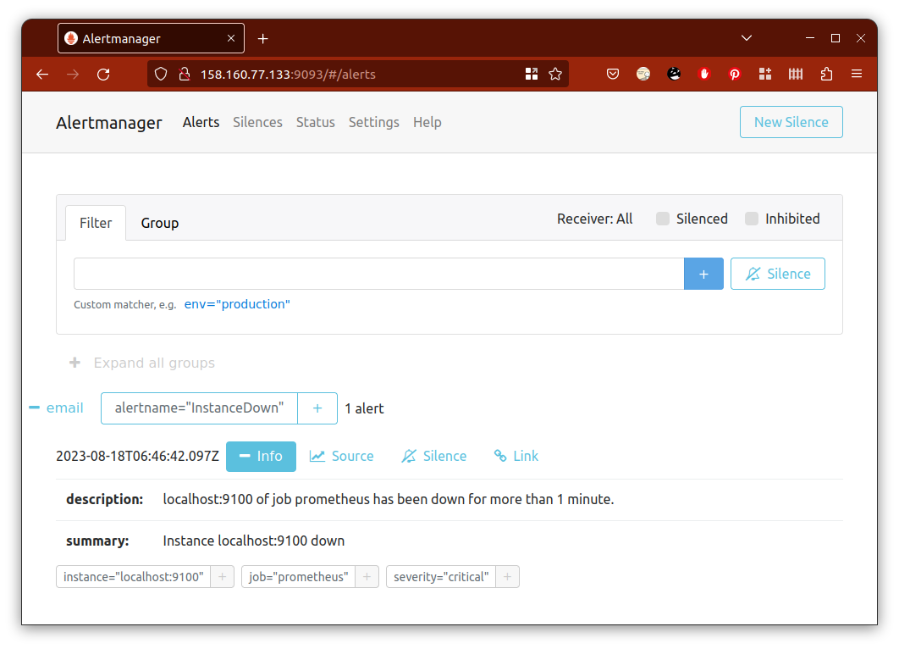

# Домашнее задание к занятию "Система мониторинга Prometheus. Часть 2" - Пешева Ирина

### Задание 1
Создайте файл с правилом оповещения, как в лекции, и добавьте его в конфиг Prometheus.

### Требования к результату
- [ ] Погасите node exporter, стоящий на мониторинге, и прикрепите скриншот раздела оповещений Prometheus, где оповещение будет в статусе Pending

### Решение 1

* Скачиваем архив с последней версией alertmanager (0.26.0) и распаковываем;
* файлы alertmanager и amtool складываем в /usr/local/bin;
* файл alertmanager.yml складываем в /etc/prometheus и предоставляем доступ к нему пользователю prometheus;
* создаём файл /etc/systemd/system/prometheus_alertmanager.service для конфигурации сервиса, добавляем и запускаем сервис;
* создаём правило в файле /etc/prometheus/instance_down_rule.yml;
* добавляем адрес alertmanager'а и правило в файл /etc/prometheus/prometheus.yml;
* настраиваем оповещение в /etc/prometheus/alertmanager.yml;
* останавливаем сервис node_exporter.service.

Предупреждение получено:

---
### Задание 2
Установите Alertmanager и интегрируйте его с Prometheus.

### Требования к результату
- [ ] Прикрепите скриншот Alerts из Prometheus, где правило оповещения будет в статусе Fireing, и скриншот из Alertmanager, где будет видно действующее правило оповещения

### Решение 2
Правило перешло в статус Fireing:

Также отобразилось в интерфейсе Alertmanager:

---
### Задание 3
Активируйте экспортёр метрик в Docker и подключите его к Prometheus.

### Требования к результату
- [ ] приложите скриншот браузера с открытым эндпоинтом, а также скриншот списка таргетов из интерфейса Prometheus.*

### Решение 3

---
### Задание 4
Создайте свой дашборд Grafana с различными метриками Docker и сервера, на котором он стоит.

### Требования к результату
- [ ] Приложите скриншот, на котором будет дашборд Grafana с действующей метрикой

### Решение 4

