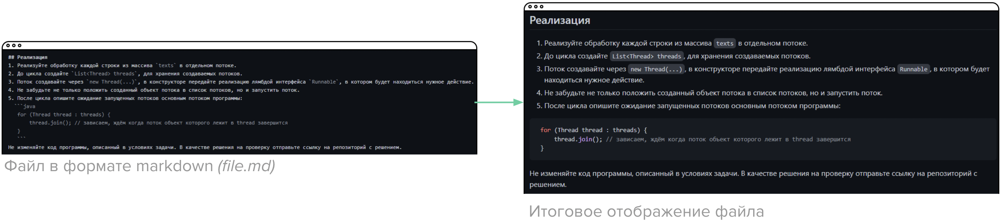
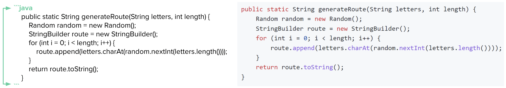
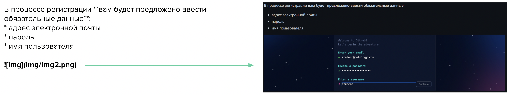

# Знакомство с MarkDown


**Markdown** - язык разметки, созданный с целью обозначения форматирования в простом тексте и сохранением максимальной читаемости текста. *Текстовые файлы, описанные в формате markdown имеют расширение файла .md*

Благодаря использованию [специализированных символов](#symbols), файл формата markdown может быть интерпретирован онлайн-сервисами, такими как GitHub, в файл, обладающий специальным графическим представлением текста.


  
#
 
### <a name="symbols"></a> Специальные символы .md

Для обозначения заголовков в markdown используется символ **#**:


  
*Для того чтобы обозначить заголовок между # и текстом обязательно должен быть пробельный символ*
  
#
 
Markdown поддерживает и **стандартные способы выделения текста**:


  
*Для переноса текста на следующую строку, используется сочетание двух пробелов в конце строки*
  
#
 
Существует также возможность использования **списков**:


  
*Вложенный список создается при помощи четырех символов пробела или табуляции*
  
#
 
Описание кода возможно и без использования нумерованного списка, с помощью набора символов **```название языка**:


  
*Использование символа ``` без указания языка позволит выделить блок без выделения цветом*
  
#
 
Для отображения в файле формата .md изображений используется синтаксис, схожий с описанием внешней ссылки  ****:


  
#
 
Важно, что путь до файла с кодом или изображением в вашем репозитории может быть указан через абсолютную или относительную ссылку. То есть для указания абсолютной ссылки на файл, опубликованный в сети, необходимо указывать ссылку в виде **"https://адрес_файла"**, а для указания относительного пути к файлу, находящемуся строго в текущем репозитории, в виде **"ДИРЕКТОРИЯ/ФАЙЛ.РАСШИРЕНИЕ"**.
