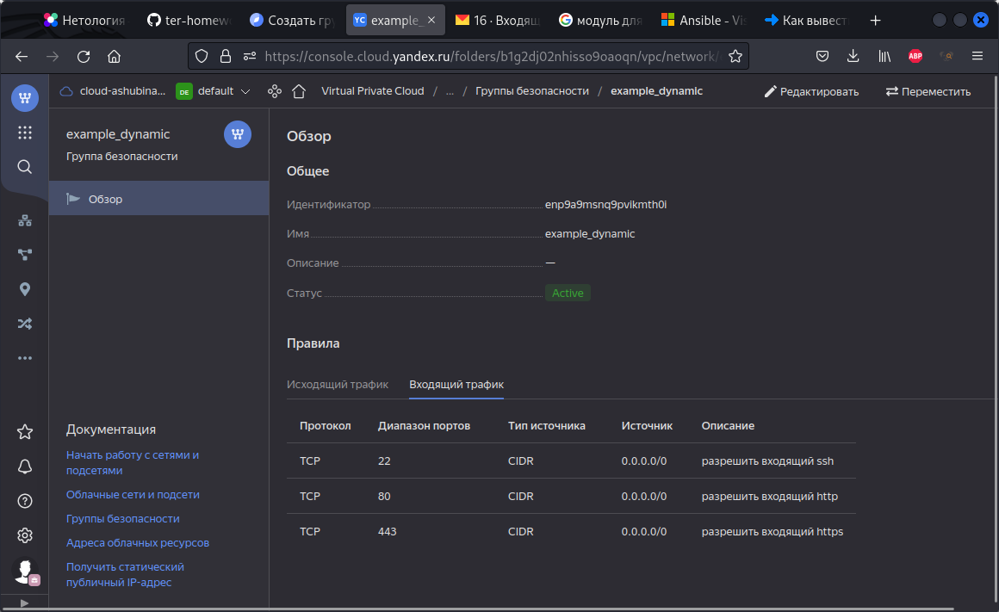

# Домашнее задание к занятию "Управляющие конструкции в коде Terraform"

### Цель задания

1. Научиться гибко управлять ресурсами в облаке Yandex Cloud с помощью Terraform.
2. Освоить работу с переменными Terraform

------

### Чеклист готовности к домашнему заданию

1. Зарегистрирован аккаунт в Yandex Cloud. Использован промокод на грант.
2. Установлен инструмент yandex cli.
3. Доступен исходный код для выполнения задания в директории [**03/src**](https://github.com/netology-code/ter-homeworks/tree/main/03/src).
4. Любые ВМ, использованные при выполнении задания должны быть прерываемыми, для экономии средств.

------

### Инструменты/ дополнительные материалы, которые пригодятся для выполнения задания

1. [Консоль управления Yandex Cloud](https://console.cloud.yandex.ru/folders/<cloud_id>/vpc/security-groups).
2. [Группы безопасности](https://cloud.yandex.ru/docs/vpc/concepts/security-groups?from=int-console-help-center-or-nav).
3. [Datasource compute disk](https://terraform-eap.website.yandexcloud.net/docs/providers/yandex/d/datasource_compute_disk.html).


### Задание 1

1. Изучите проект.
2. Заполните файл personal.auto.tfvars
3. Инициализируйте проект, выполните код (он выполнится даже если доступа к preview нет).

Примечание: Если у вас не активирован preview доступ к функционалу "Группы безопасности" в Yandex Cloud - запросите доступ у поддержки облачного провайдера. Обычно его выдают в течении 24-х часов.



Приложите скриншот входящих правил "Группы безопасности" в ЛК Yandex Cloud  или скриншот отказа в предоставлении доступа к preview версии.

------

### Задание 2

1. Создайте файл count-vm.tf. Опишите в нем создание двух **одинаковых** виртуальных машин с минимальными параметрами, используя мета-аргумент **count loop**.

```
# create 2 VM
resource "yandex_compute_instance" "exercise_1" {
  name        = "netology-develop-platform-web-${count.index}"
  platform_id = "standard-v1"
  count = 2
  resources {
    cores  = 2
    memory = 1
    core_fraction = 20
  }
  boot_disk {
    initialize_params {
      image_id = data.yandex_compute_image.ubuntu-2004-lts.image_id
      type = "network-hdd"
      size = 5
    }   
  }
  metadata = {
    ssh-keys = "ubuntu:${local.public_key}"
  }
  scheduling_policy { preemptible = true }
  network_interface { 
    subnet_id = yandex_vpc_subnet.develop.id
    nat       = true
  }
  allow_stopping_for_update = true
}
```

2. Создайте файл for_each-vm.tf. Опишите в нем создание 2 **разных** по cpu/ram/disk виртуальных машин, используя мета-аргумент **for_each loop**. Используйте переменную типа list(object({ vm_name=string, cpu=number, ram=number, disk=number  })). При желании внесите в переменную все возможные параметры.
3. ВМ из пункта 2.2 должны создаваться после создания ВМ из пункта 2.1.
```
# create 2 VM
resource "yandex_compute_instance" "exercise_2" {
 depends_on = [yandex_compute_instance.exercise_1]
 for_each = {
   for res_vm in var.res_vm: res_vm.vm_name => res_vm
 }
 name        = each.value.vm_name
 platform_id = "standard-v1"
 resources {
   cores  = each.value.cpu
   memory = each.value.ram
   core_fraction = 20
 }
 boot_disk {
  initialize_params {
   image_id = data.yandex_compute_image.ubuntu-2004-lts.image_id
   type = "network-hdd"
   size = each.value.disk
  }   
 }
 metadata = {
   ssh-keys = "ubuntu:${local.public_key}"
 }
 scheduling_policy { preemptible = true }

 network_interface { 
  subnet_id = yandex_vpc_subnet.develop.id
  nat       = true
 }
allow_stopping_for_update = true
}

```
4. Используйте функцию file в local переменной для считывания ключа ~/.ssh/id_rsa.pub и его последующего использования в блоке metadata, взятому из ДЗ №2.
```
locals  {
  public_key = file ("~/.ssh/id_rsa.pub")
}

...

 metadata = {
   ssh-keys = "ubuntu:${local.public_key}"
 }
```
5. Инициализируйте проект, выполните код.

------

### Задание 3

1. Создайте 3 одинаковых виртуальных диска, размером 1 Гб с помощью ресурса yandex_compute_disk и мета-аргумента count.
```
# create 3 disks
resource "yandex_compute_disk" "volume" {
    count = 3
    name       = "netology-volume-${count.index}"
    type       = "network-hdd"
    size       = 1
}
# create VM
resource "yandex_compute_instance" "exercise_3" {
  name        = "netology-develop-platform-web-ex3"
  platform_id = "standard-v1"
  resources {
    cores  = 2
    memory = 1
    core_fraction = 20
  }
  boot_disk {
    initialize_params {
      image_id = data.yandex_compute_image.ubuntu-2004-lts.image_id
      type = "network-hdd"
      size = 5
    }   
  }
  metadata = {
    ssh-keys = "ubuntu:${local.public_key}"
  }
  scheduling_policy { preemptible = true }
  network_interface { 
    subnet_id = yandex_vpc_subnet.develop.id
    nat       = true
  }
  allow_stopping_for_update = true
```
2. Создайте одну **любую** ВМ. Используйте блок **dynamic secondary_disk{..}** и мета-аргумент for_each для подключения созданных вами дополнительных дисков.

> К сожалению тут пока возникли сложности, не могу сообразить как отдать индексы вместо [1], поэтому пока заккоментировал.

```
#  dynamic "secondary_disk" {
#     for_each = yandex_compute_disk.volume
#       content {
#       disk_id     = yandex_compute_disk.volume[1].id
#       auto_delete = true
#     }
# }
```
3. Назначьте ВМ созданную в 1-м задании группу безопасности.

> Не совсем понял задание, посмотрев в админке yandex cloud вижу что данная группа безопасности навешивается на сеть, а не на хост.... 

------

### Задание 4

1. Создайте inventory-файл для ansible.
Используйте функцию tepmplatefile и файл-шаблон для создания ansible inventory-файла из лекции.
Готовый код возьмите из демонстрации к лекции [**demonstration2**](https://github.com/netology-code/ter-homeworks/tree/main/demonstration2).
Передайте в него в качестве переменных имена и внешние ip-адреса ВМ из задания 2.1 и 2.2.
2. Выполните код. Приложите скриншот получившегося файла.

Для общего зачета создайте в вашем GitHub репозитории новую ветку terraform-03. Закомитьте в эту ветку свой финальный код проекта, пришлите ссылку на коммит.   
**Удалите все созданные ресурсы**.

------

## Дополнительные задания (со звездочкой*)

**Настоятельно рекомендуем выполнять все задания под звёздочкой.**   Их выполнение поможет глубже разобраться в материале.   
Задания под звёздочкой дополнительные (необязательные к выполнению) и никак не повлияют на получение вами зачета по этому домашнему заданию. 

### Задание 5*(необязательное)
1. Напишите output, который отобразит все 5 созданных ВМ в виде списка словарей:
``` 
[
 {
  "name" = 'имя ВМ1'
  "id"   = 'идентификатор ВМ1'
  "fqdn" = 'Внутренний FQDN ВМ1'
 },
 {
  "name" = 'имя ВМ2'
  "id"   = 'идентификатор ВМ2'
  "fqdn" = 'Внутренний FQDN ВМ2'
 },
 ....
]
```
Приложите скриншот вывода команды ```terrafrom output```

------

### Задание 6*(необязательное)

1. Используя null_resource и local-exec примените ansible-playbook к ВМ из ansible inventory файла.
Готовый код возьмите из демонстрации к лекции [**demonstration2**](https://github.com/netology-code/ter-homeworks/tree/main/demonstration2).
3. Дополните файл шаблон hosts.tftpl. 
Формат готового файла:
```netology-develop-platform-web-0   ansible_host="<внешний IP-address или внутренний IP-address если у ВМ отсутвует внешний адрес>"```

Для проверки работы уберите у ВМ внешние адреса. Этот вариант используется при работе через bastion сервер.
Для зачета предоставьте код вместе с основной частью задания.

### Правила приема работы

В своём git-репозитории создайте новую ветку terraform-03, закомитьте в эту ветку свой финальный код проекта. Ответы на задания и необходимые скриншоты оформите в md-файле в ветке terraform-03.

В качестве результата прикрепите ссылку на ветку terraform-03 в вашем репозитории.

ВАЖНО!Удалите все созданные ресурсы.

### Критерии оценки

Зачёт:

* выполнены все задания;
* ответы даны в развёрнутой форме;
* приложены соответствующие скриншоты и файлы проекта;
* в выполненных заданиях нет противоречий и нарушения логики.

На доработку:

* задание выполнено частично или не выполнено вообще;
* в логике выполнения заданий есть противоречия и существенные недостатки. 

test