# Домашнее задание к занятию `«11.4 Очереди RabbitMQ»` - `Васильев Николай`

---
## Задание 1. Установка RabbitMQ

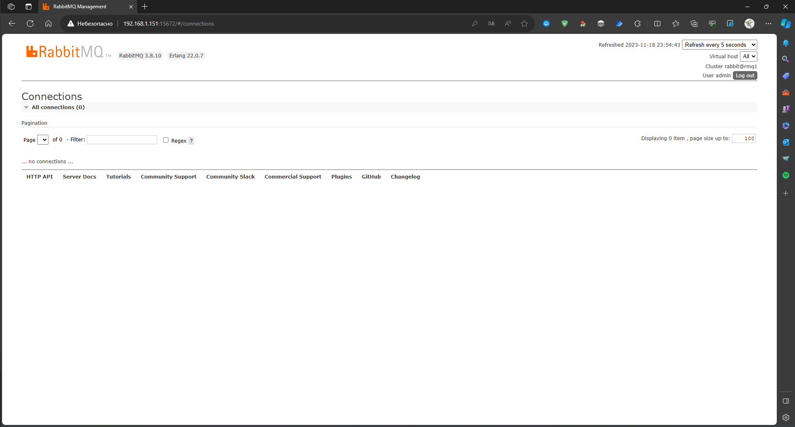

---
## Задание 2. Отправка и получение сообщений

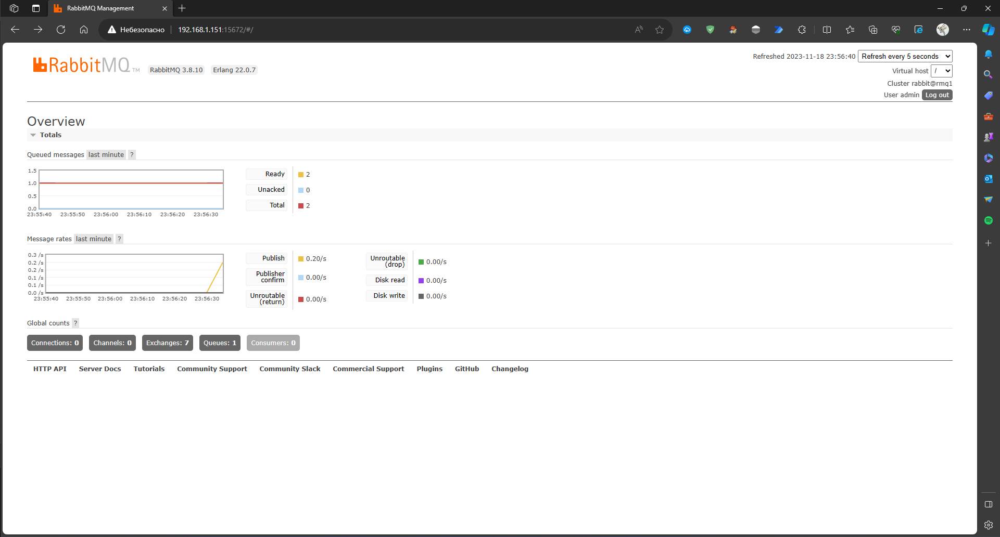
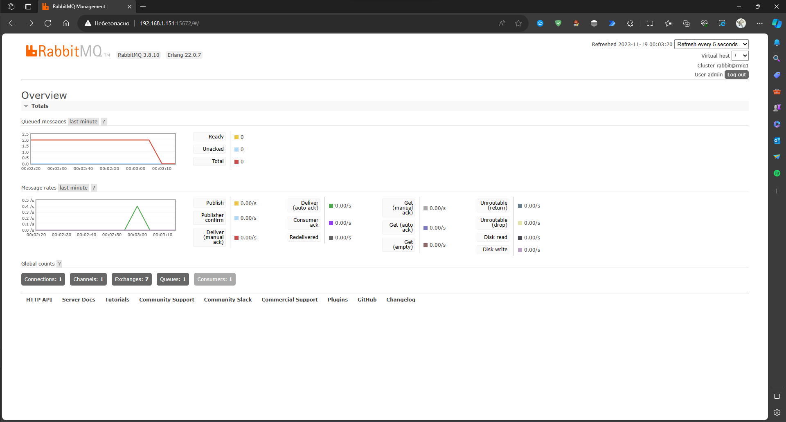

---
## Задание 3. Подготовка HA кластера

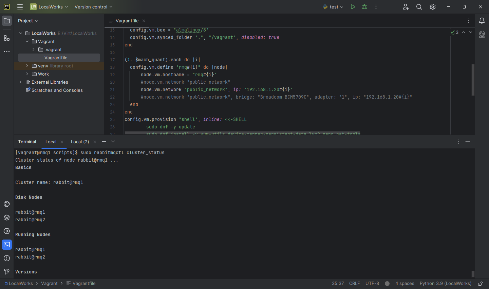
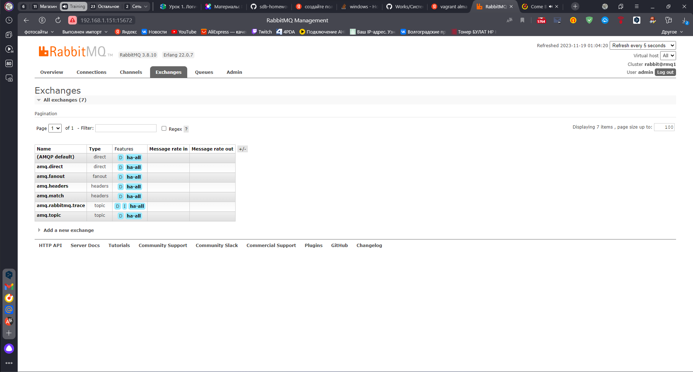
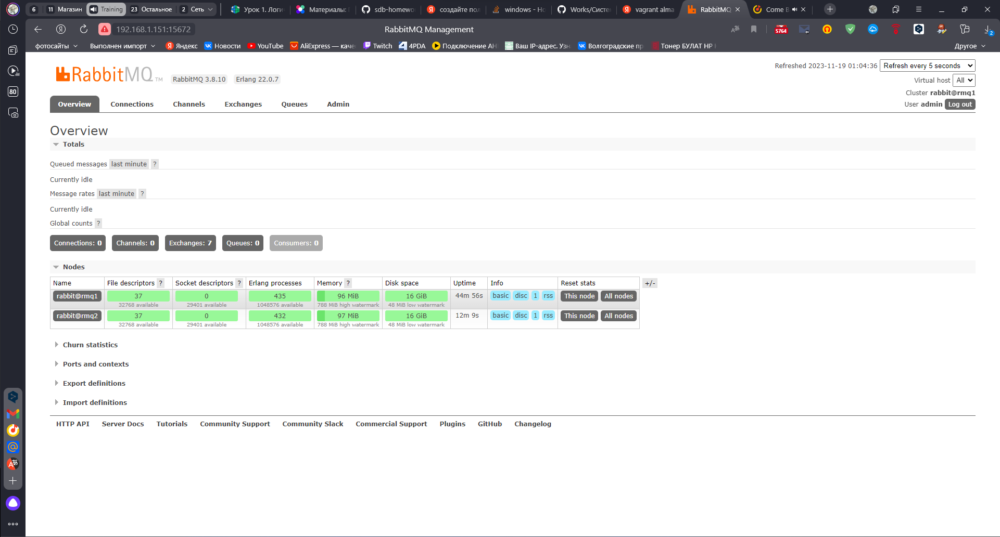
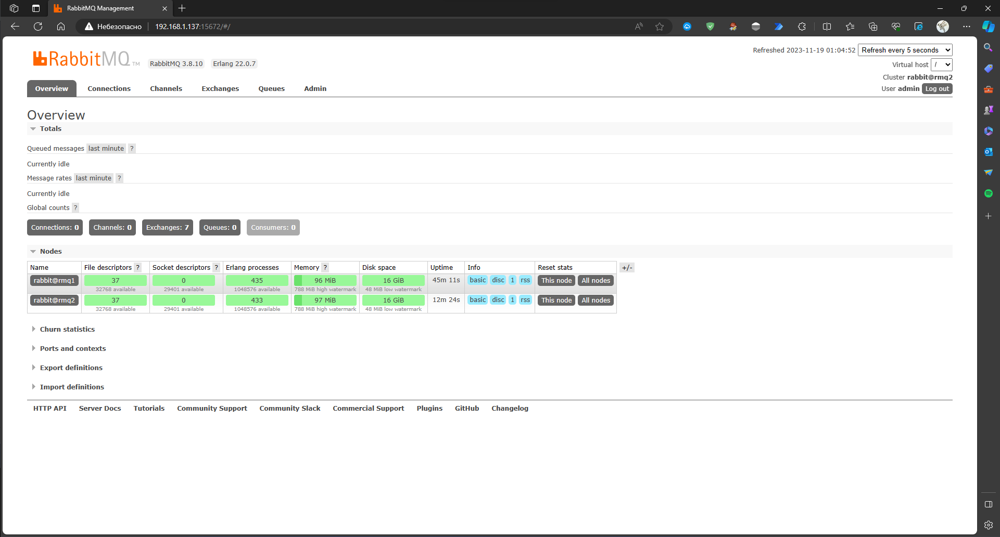
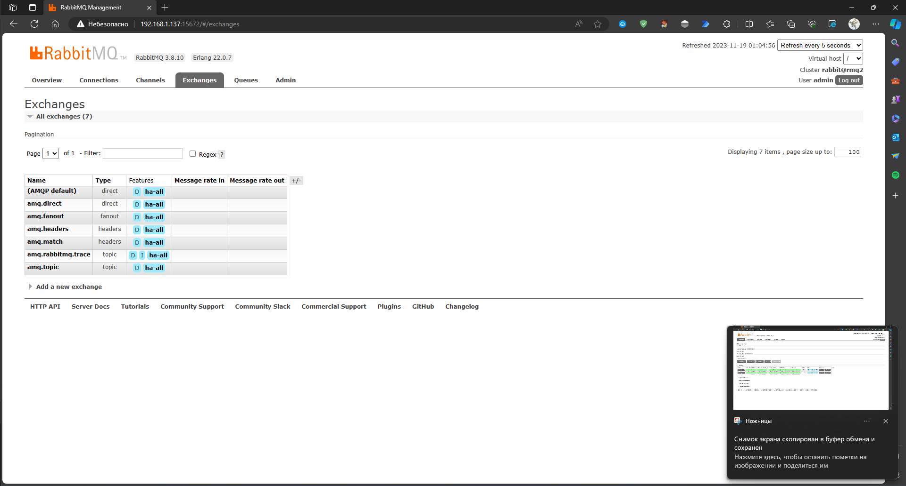
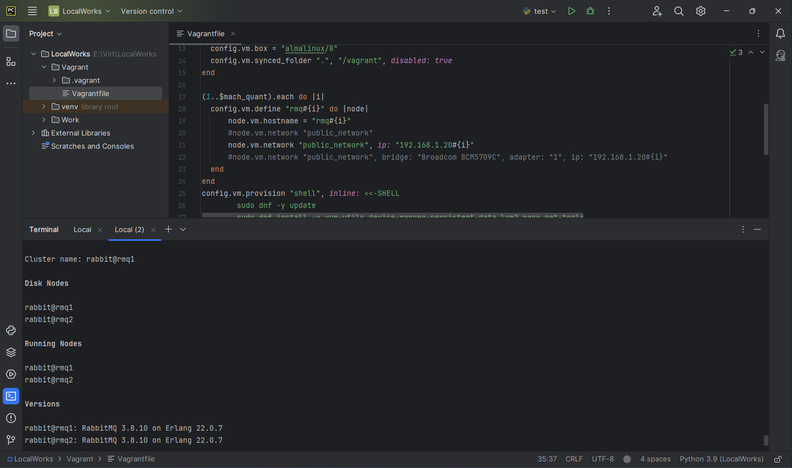
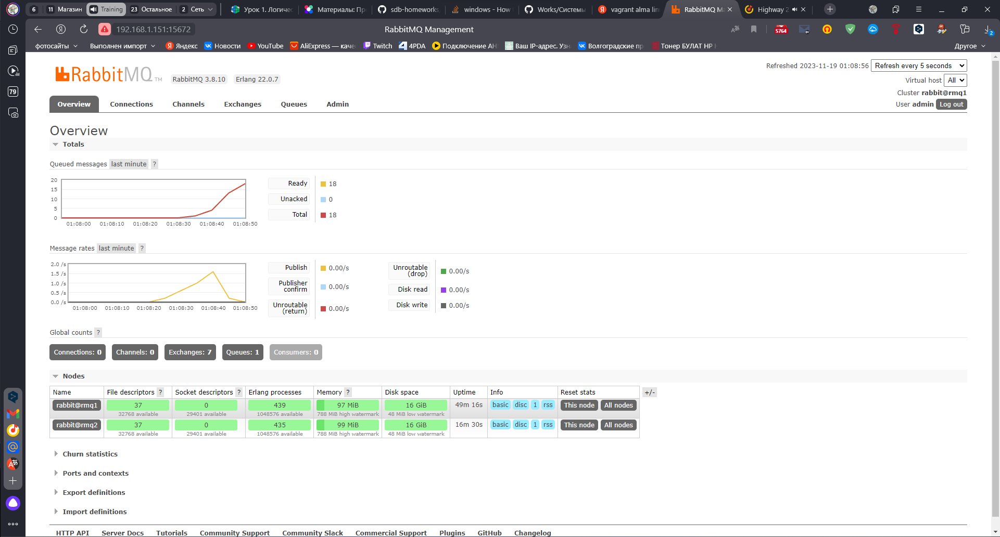
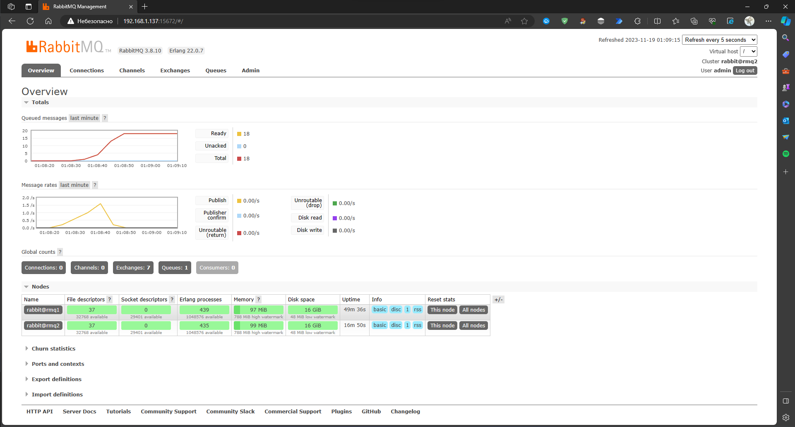
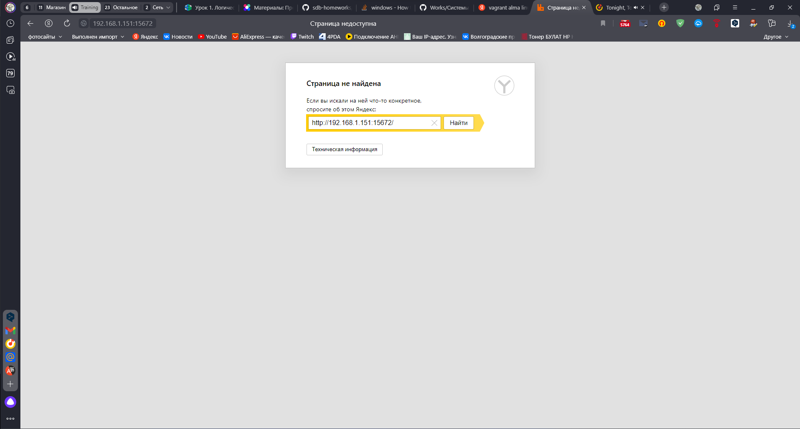
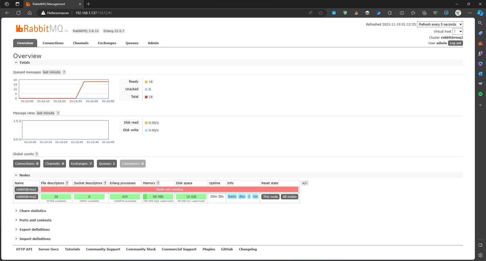
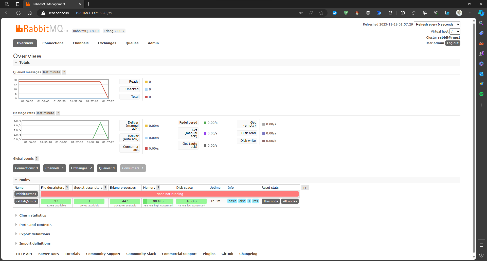
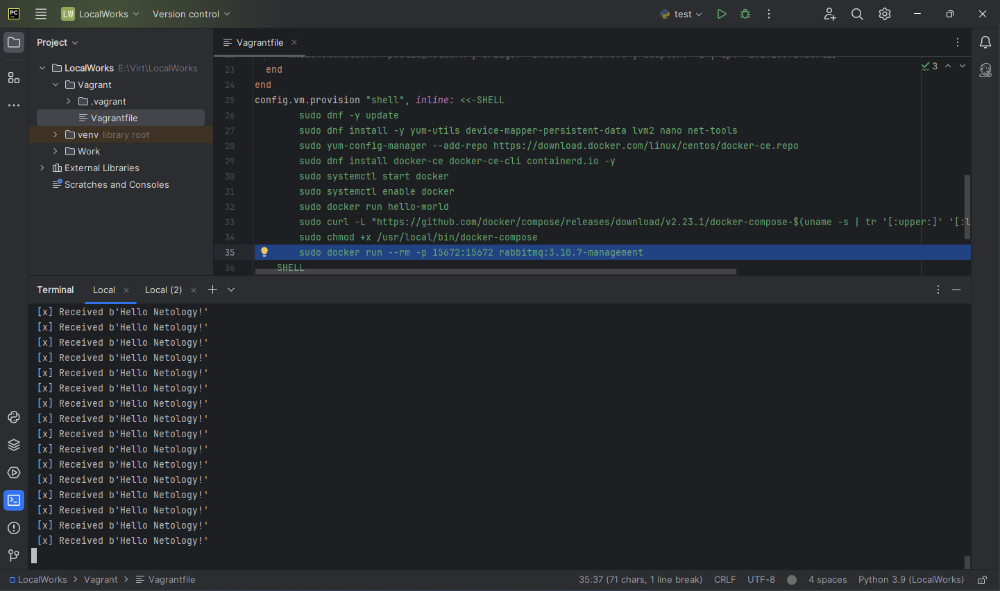
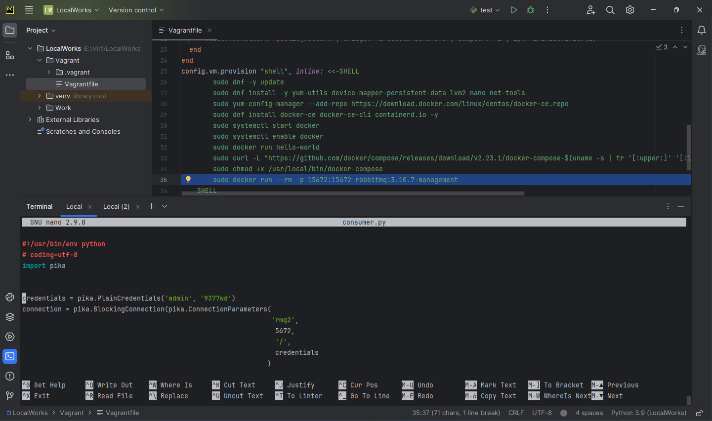