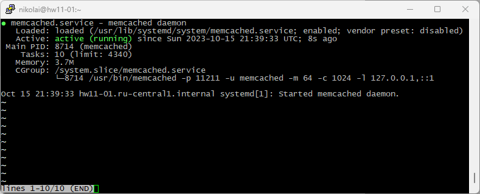
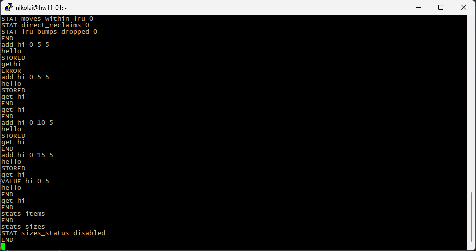
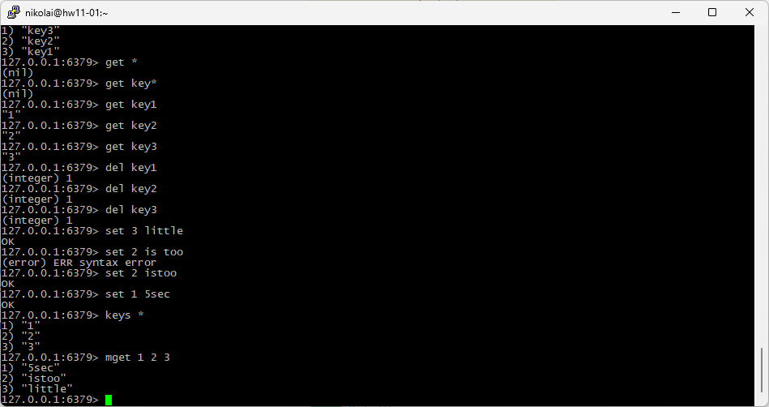

# Домашнее задание к занятию `«11.2 Кеширование Redis/memcached»` - `Васильев Николай`

---
## Задание 1. Кеширование
* Позволяет снизить нагрузку на сервера и экономить ресурсы. 
* Временное хранилище с наиболее запрашиваемыми или редко меняющимися данными, позволяет повысить производительность и скорость ответа на запросы.

---
## Задание 2. Memcached

---
## Задание 3. Удаление по TTL в Memcached

---
## Задание 4. Запись данных в Redis

